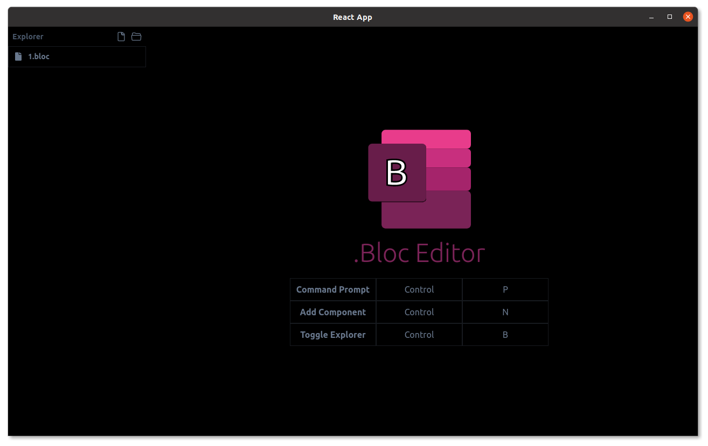
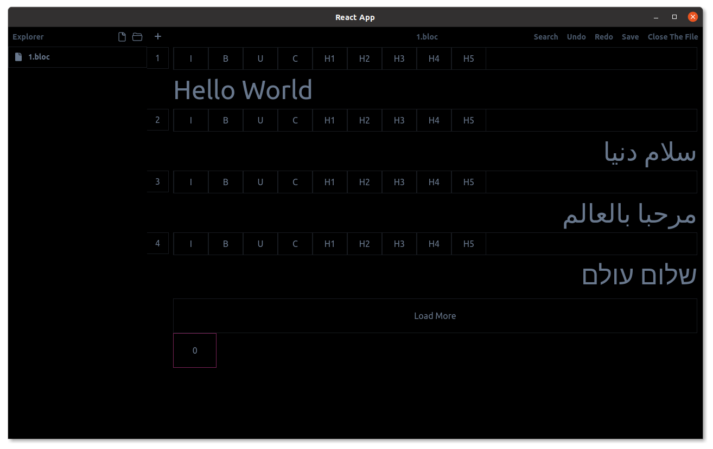

# What is Bloc Editor ?

Bloc Editor is a free and powerful app to manage and store set of related data as component inside a compact package which called bloc with extension .bloc. each .bloc file contain many type of component
# What Kind Of Data I Can Store ?
##### Component That You Can Use Now:

- **Link Preview**
- **Image** 
- **Code**
- **Text** 
- **Streamable Meida** => **Youtube Video**,**Viemo**, **Sound Cloud**,**Facebook**,**Twitch**
##### But More Components Are Planned To Add Before `version1` Release
- **Markdown Editor**, 
 - **Map**, 
 - **Table**,
 - **Chart**,
 - **Excel Grid Table**
# How Backup And Sync .Bloc Files ?
because Bloc Editor doesn't use database to store data and all data are stored in a simple file you just drop them into any cloud service **[dropbox,google drive,pcloud,onedrive, Yandex Drive, Beidu drive ...]** etc. folder so after each change in .bloc file you only upload that chunk of file that is changed. 
read more about **( Block Level File Sync)**
# RTL Support ?

it is planned to fully support all RTL language like 
- Arabic
- Aramaic
- Azeri
- Dhivehi/Maldivian
- Hebrew
- Kurdish (Sorani)
- Persian/Farsi
- Urdu
# OS support ?
- Linux @Supported
    - deb
    - rpm
    - Appimage
    - snap
    - pacman
    - Flatpak @soon
- Windows @Supported
    - exe file
- Mac @Soon
    - dmg 

# How To Contribute ?
you can test the app and give feedback at github issue.